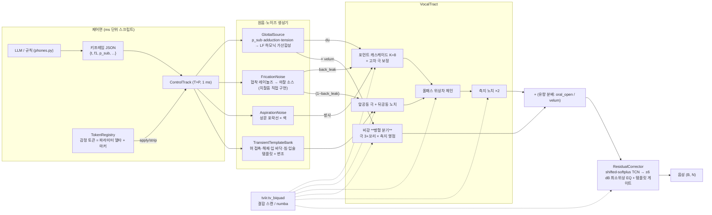
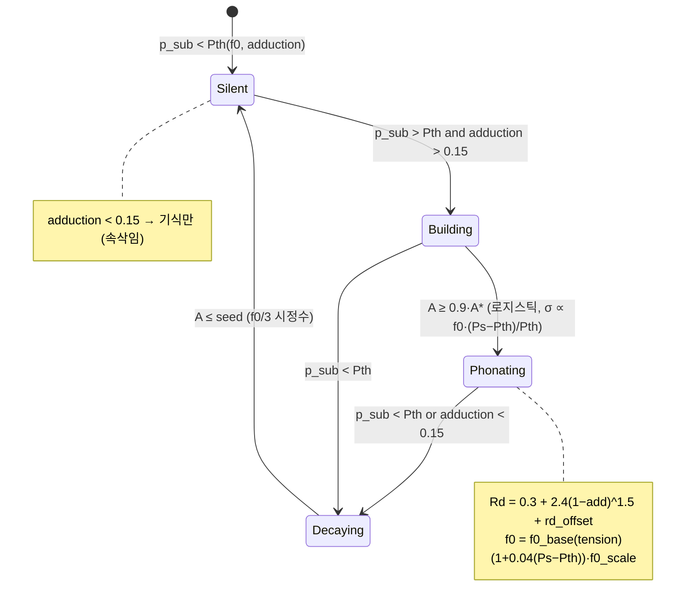
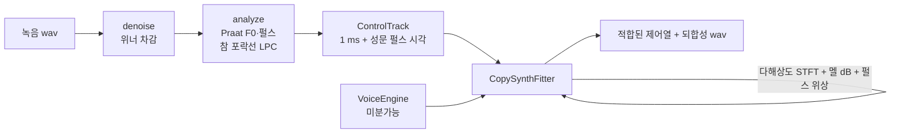

# 아키텍처 (v2, `formant_ml.engine`)

> 신경망은 파형을 만들지 않는다. 물리 파라미터(제어열)만 만든다. 파형은 방정식이 만들고,
> 모든 필터는 **샘플 단위로 계수가 변하는 인과 재귀 필터**라 위상은 상태의 연속성으로 보장된다.

## 1. 컴포넌트 다이어그램



## 2. 클래스 다이어그램

```mermaid
classDiagram
  class EngineConfig { +sample_rate=48000 +frame_ms=1.0 +speaker="female" +tract_length_cm=14.6 +hop }
  class VoiceEngine {
    +glottis: GlottalSource
    +frication: FricationNoise
    +aspiration: AspirationNoise
    +transients: TransientTemplateBank
    +tract: VocalTract
    +residual: ResidualCorrector
    +state: dict
    +forward(ctrl, events, t_offset, state) dict
    +render(track) ndarray
    +stream(track, chunk_ms) Iterator
    +reset()
  }
  class ControlTrack { +values: ndarray(T,P) +frame_ms +events: list +__getitem__(name) +clamp() +to_tensor() }
  class SpeakerProfile { +tract_length_cm +f0_nominal/lo/hi +vowels +lateral +tap +sibilant +nasal +timing +load()/save() +sib_front_len_cm }
  class Builder { +vowel() +lateral() +tap() +sibilant() +affricate() +nasal() +build() ControlTrack }
  Builder --> SpeakerProfile
  VoiceEngine --> SpeakerProfile : f0 range, tract length
  class ParamSpec { +name +unit +lo +hi +default +log +doc }
  class GlottalSource { +physiology(c) dict +forward(c, phase0, rps) dict +threshold(f0, add) +lf_coef: buffer }
  class FricationNoise { +log_beta +log_knee +log_amp +log_lp_ratio +forward(c, ag_dc, phase, voiced) dict }
  class AspirationNoise { +log_amp +forward(asp_env) Tensor }
  class TransientTemplateBank { +bank: Parameter(M,L) +names +add(name, wave) int +render(events, n) Tensor }
  class VocalTract { +uniform_formants +extra_formants +log_extra_bw +log_front_bw +forward(du, fric, asp, transient, c, state) dict }
  class ResidualCorrector { +body: SSPTCN +eq_f +forward(ctrl_frames, cond) dict +apply(audio, heads, mix, extra, state) dict }
  class TokenRegistry { +tokens: dict +budget +allowed +spawn() Token +apply(track, name, t0, t1, strength) +strip(track, names) +freeze() +exclude() +prune() +markers(track) +save()/load() }
  class Token { +id +name +emotion +delta: list +reason +usage_count +frozen +excluded +tags +support +describe() }
  class TokenTable { +delta: Parameter(M,P) +add_token() +effective_delta() +forward(weights) }
  class TokenDiscovery { +observe(delta, emotion, loss) +propose() list }
  class SSPTCN { +receptive_field +forward(x) }
  VoiceEngine *-- EngineConfig
  VoiceEngine *-- GlottalSource
  VoiceEngine *-- FricationNoise
  VoiceEngine *-- AspirationNoise
  VoiceEngine *-- TransientTemplateBank
  VoiceEngine *-- VocalTract
  VoiceEngine *-- ResidualCorrector
  VoiceEngine ..> ControlTrack : consumes
  ControlTrack ..> ParamSpec : PARAMS
  TokenRegistry o-- Token
  TokenRegistry ..> ControlTrack : apply/strip
  TokenTable --> TokenRegistry
  TokenDiscovery ..> TokenRegistry : propose → spawn
  ResidualCorrector *-- SSPTCN
```



## 3. 시퀀스 다이어그램 — 스트리밍 합성

```mermaid
sequenceDiagram
  participant App
  participant VE as VoiceEngine
  participant G as GlottalSource
  participant N as Noise×3
  participant T as VocalTract
  participant R as ResidualCorrector
  App->>VE: stream(track, chunk_ms=20)
  VE->>VE: reset() — phase=None, zi={}
  loop 청크마다 (20 프레임 = 20 ms)
    VE->>G: forward(c_chunk, phase0=state.phase)
    G-->>VE: du, phase, asp_env, ag_dc, voiced
    VE->>N: frication(c, ag_dc, phase) / aspiration(asp_env) / transients.render(events in chunk)
    N-->>VE: fric, asp, transient
    VE->>T: forward(du, fric, asp, transient, c, state=zi)
    T-->>VE: audio, zi'
    VE->>R: apply(audio, heads(ctrl), mix, state)
    R-->>VE: audio', zi_r'
    VE->>VE: state.phase = phase[-1]; state.tract = zi'
    VE-->>App: audio chunk (경계 없음: 오프라인과 1e-3 이내)
  end
```

## 4. 상태 다이어그램 — 발성 (성문)



## 5. 활동 다이어그램 — 감정 토큰 생명주기

```mermaid
flowchart TD
  A[학습 스텝: 잔차 큰 프레임의 제어 델타 + 감정 라벨] --> B[TokenDiscovery.observe]
  B --> C{propose: 감정별 k-평균, support ≥ min}
  C -- 후보 --> D[TokenRegistry.spawn → 이름 자동 부여 angry_sigh_00]
  D --> E[TokenTable.add_token → 델타 학습 계속]
  E --> F{사람 검토}
  F -- 이름/태그 --> G[rename / tag]
  F -- 고정 --> H[freeze: 기울기 차단]
  F -- 사용 금지 --> I[exclude: 합성에서 제외]
  F -- 증거 부족 --> J[prune]
  G & H --> K[스크립트: apply(track, name, t0, t1) → 마커 기록]
  K --> L[후처리: markers(track) 로 식별, strip 으로 제거/교체]
```

## 6. 배포 / 패키지 구조

```
src/formant_ml/
  engine/            v2 (이 문서)          — 0.2.x 부터 주 경로
    tviir.py         시변 2차 재귀 필터 (scan / seq / numba)
    control.py       파라미터 표 · 키프레임 → ControlTrack · 샘플률 보간
    rng.py           위치 기반 난수 (스트리밍 = 오프라인의 전제)
    glottis.py       압력 구동 성문 소스 (LF 가산합성)
    noise.py         마찰 / 기식 / 과도음 템플릿
    tract.py         포먼트 + 올패스 → 비강 → 측지
    residual.py      잔차 보정 (shifted softplus TCN)
    nn.py            shifted softplus 블록
    tokens.py        감정 토큰
    voice.py         VoiceEngine
    phones.py        한국어 음소 제스처 (구조만; 숫자는 프로파일)
    profile.py       SpeakerProfile — 화자 한 명 = JSON 한 장 (profiles/*.json)
    denoise.py       위너 스펙트럼 차감 (복사합성 전처리)
    analyze.py       녹음 → 1 ms 제어열 초기값 (Praat F0·펄스 + 참 포락선 LPC 포먼트)
    fit.py           복사합성 적합기 — 미분가능 엔진으로 제어열 역추정
  dsp/, models/, …   v1 (0.1.x) — 동결. 참고용. 새 기능을 넣지 않는다.
tests/engine/        v2 성질 테스트
docs/adr/            결정 기록
```

## 7. 불변량 (테스트가 고정하는 것)

1. `tv_biquad` 결합 스캔 == 순차 == scipy.lfilter (상수 계수) == numba 실시간 경로.
2. 파라미터가 한 샘플에 급변해도 출력 파형은 연속 (샘플 차분 ≤ 정상 구간의 2 배).
3. 스트리밍 청크 이어붙임 == 오프라인 (성도·성문·잡음·잔차 모두). 잡음은 위치 기반 난수(`rng.NoiseBank`), 선행 1 프레임(1 ms) 으로 샘플 보간까지 일치.
4. 극 반지름 `exp(−πBW/fs) < 1` → 어떤 입력에도 유한.
5. 역치 아래에서 성문 출력 정확히 0, 벌린 성문(adduction<0.15)은 기식만.
6. 모음 자세(a_c=3 cm²)에서 Re < 1800 → 마찰 소스 정확히 0.
7. 잔차망·토큰 표는 0 초기화 → 학습 전 항등.
8. 토큰 apply → strip 이 제어열을 정확히 복원한다.
9. `f0_target > 0` 이면 렌더된 F0 가 **그 값 그대로**다. 폐압-F0 결합은 긴장으로 F0 를
   정할 때만 걸린다 (0.3.1 이전에는 위에 또 곱해져 ×1.18 이었다).
10. 제스처 세기(설측·탄음·비음)가 프로파일의 실측 목표 dB 안에 든다. 창은 프레임 번호가
    아니라 **제어열**에서 읽는다 — 지속시간이 화자마다 다르다.
11. 적합기의 최선 파라미터 사본은 `opt.step()` **앞에서** 뜬다. 되돌린 해의 손실이
    기록된 최선과 같아야 한다.
12. 전역 오프셋은 포먼트·F0 를 건드리지 않는다. 포먼트 순서와 대역폭 상한은 벌점이 강제한다.

## 8. 복사합성 경로 (0.3.x)



단계: 전역 스칼라(30) → 제어 격자 20 → 10 → 5 → 1 ms, 창 256 → 4096.
성기게 시작하는 이유는 긴 창부터 켜면 F0 에 대한 손실면이 하모닉 간격마다 골이 파인
톱니가 되어 가장 가까운 가짜 골에 갇히기 때문이다.

### 실험용 LF–난류 결합

`EngineConfig(noise_modulation="lf")` 는 같은 Rd 격자의 LF 유량미분을 적분한
유량 형태로 기식·마찰의 주기 변조를 함께 구동한다. 독립 OQ·결합 지연·깊이 제어열을
추가하지 않는다. 주기 평균을 기준으로 정규화하므로 청크 길이에 의존하지 않으며,
무성 구간에는 주기 변조를 걸지 않는다. 종전 평균 소스 수준은 보존하지만 출력 RMS
또는 청취 품질이 동일하다는 보장은 아니다.

기본값 `"legacy"` 는 기존 개방 마스크·코사인 변조를 유지한다. LF 옵션은
미사용 발화·청취 검증 전까지 기본값으로 승격하지 않는다. 이는 유량 형태를 사용한
AM 실험이지 성문–성도 압력 피드백이나 완전한 공기역학 결합이 아니다.

마찰의 `log_knee` 는 계수와 이득을 통해 미분 가능하다. `log_beta` 는 기존
체크포인트를 읽기 위한 **비학습 버퍼**이며 고정 2극 필터의 기울기를 조절하지 않는다.
`log_knee`, `log_amp`, `log_lp_ratio` 등 엔진 내부 변수는 기본 `CopySynthFitter`
optimizer 에 포함되지 않는다. 제어열 민감도, 엔진 내부 기울기, 여러 발화에서의
식별 가능성을 구별해야 한다.
